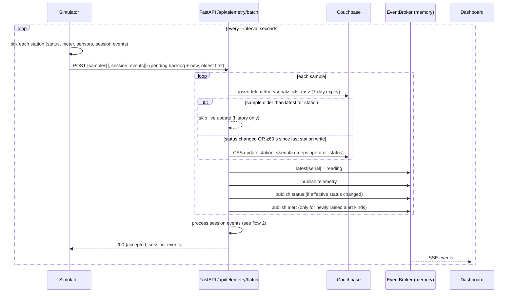
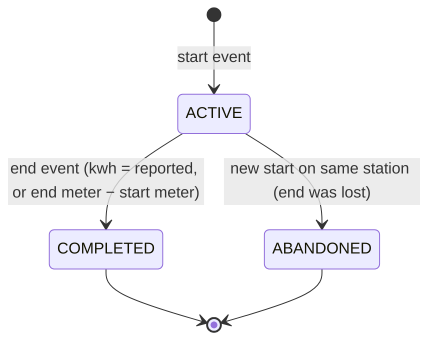
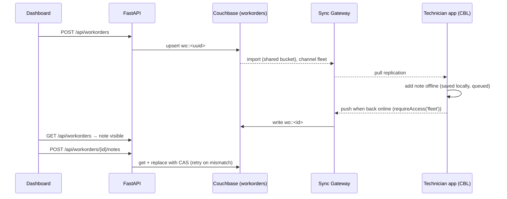

# EVSE FleetOps — Data Flow

How data moves through the system, flow by flow. Component names match
[architecture](architecture.md); the reasons behind each rule are in
[design](design.md).

## 1. Telemetry ingest (charger → backend → dashboard)



**Sample shape** (`POST /api/telemetry/batch`):

```json
{
  "samples": [
    {"station_id": "EVSE-000", "ts": "2026-09-23T15:00:00.000Z", "status": "CHARGING",
     "meter_kwh": 1234.5, "temperature_c": 38.1, "humidity_pct": 51.0,
     "vibration_mm_s": 2.3, "load_kw": 24.8}
  ],
  "session_events": [
    {"station_id": "EVSE-000", "event": "start", "ts": "2026-09-23T15:00:00.000Z",
     "connector": "CCS2", "session_id": "9f…", "start_meter_kwh": 1234.5}
  ]
}
```

`status` ∈ `AVAILABLE | CHARGING | FAULTED | MAINTENANCE | OFFLINE`;
`connector` ∈ `CCS1 | CCS2 | CHAdeMO | TYPE2`. Any other value gets the whole batch a 422.

**What gets stored where**

| Data | Couchbase | Memory (`EventBroker`) | SSE |
| --- | --- | --- | --- |
| Every sample | `telemetry` doc | — | `telemetry` event |
| Latest reading per station | station doc (throttled) | `latest[serial]` | via `snapshot` and `telemetry` |
| Status change | station doc | `latest[serial].status` | `status` event |
| Threshold breach | — | `raised_alerts[serial]` | `alert` event (on first breach) |

## 2. Charging session lifecycle



1. **start**: upsert `session::<id>` as `ACTIVE`, add it to `broker.active_sessions[station]`, publish `session` (start).
2. **end**: take the session from memory; if it isn't there, load `session::<session_id>` from Couchbase and continue only if it's `ACTIVE`. Set `COMPLETED`, `end_ts` and `kwh_delivered`, upsert, publish `session` (end).
3. **Backend restart**: `load_active_sessions()` rebuilds the in-memory map from `sessions WHERE state = 'ACTIVE'`.
4. **kWh today** (`/api/fleet/overview`) = sum of `kwh_delivered` for `COMPLETED` sessions whose `end_ts` falls in the current UTC day.

## 3. Simulator outage and recovery

```
tick 1  backend down  → pending = [s1]            → sleep 1 s
tick 2  backend down  → pending = [s1, s2]        → sleep 2 s
tick 3  backend down  → pending = [s1, s2, s3]    → sleep 4 s  (max 30 s)
tick 4  backend up    → POST [s1, s2, s3, s4]     → 200 → pending cleared, backoff reset
```

- Session events are kept in the same way and sent in order along with the samples.
- More than 500 pending samples: the oldest are dropped and counted as `dropped` in the log.
- An invalid-payload 4xx (anything except 404/408/425/429): pending data is discarded and the response body is logged.

## 4. Dashboard live updates

```mermaid
sequenceDiagram
    participant UI as Dashboard (useLiveEvents)
    participant API as FastAPI

    UI->>API: GET /api/events/stream (EventSource via Vite proxy)
    API-->>UI: event: snapshot {type, latest{}, recent[50]}
    loop live
        API-->>UI: event: telemetry | status | session | alert | workorder
        UI->>UI: prepend to feed (max 40); update latest[station] on telemetry/status
    end
    Note over UI,API: on error, close and reconnect after 3 s
    loop every 15 s while stream is down
        UI->>API: GET /api/telemetry/latest
    end
```

The pages also fetch on their own:

- **Overview:** `GET /api/fleet/overview` every 10 s, and immediately after a `status` or `session` event.
- **Stations:** `GET /api/stations` on filter change. Cards take live values from `latest`. Selecting a card loads `GET /api/stations/{serial}/timeseries` for the last 6 h.
- **Work orders:** `GET /api/workorders` on load and after each change. Create is `POST`, status is `PUT`, notes are `POST /notes`.

## 5. Operator status override

```
Dashboard ──PATCH /api/stations/EVSE-005 {status: MAINTENANCE}──▶ API
   API: CAS update station doc: status = MAINTENANCE, operator_status = MAINTENANCE
   API: force next sample to rewrite the station doc; set latest.status; publish status
Next sample reports CHARGING:
   station doc keeps status = MAINTENANCE (readings still update)
Dashboard ──PATCH {status: AVAILABLE}──▶ operator_status cleared → next sample's status applies again
```

## 6. Work orders: dashboard, backend and mobile



- API responses expose `id` = document key without `wo::`. The mobile app uses the full key.
- Conflicts between two *devices* resolve last-write-wins in Sync Gateway. Between the backend and a device, the backend's CAS retry re-applies its change on top of the device's write.

## 7. Provisioning flow (`make up`)

```
couchbase-server (healthy)
   └─▶ cb-init          services kv,n1ql,index · quotas · admin credentials   (skips if already initialized)
         └─▶ bootstrap  bucket · 6 collections · indexes · seed 12 stations, 4 manuals, 2 work orders, 1 technician
               └─▶ sync-gateway (healthy)
                     └─▶ sg-db-init  create fleetops DB from sg-db.json (or POST-merge if it exists) · user tech_garcia
```

The backend repeats the bootstrap step on every start (idempotent).
